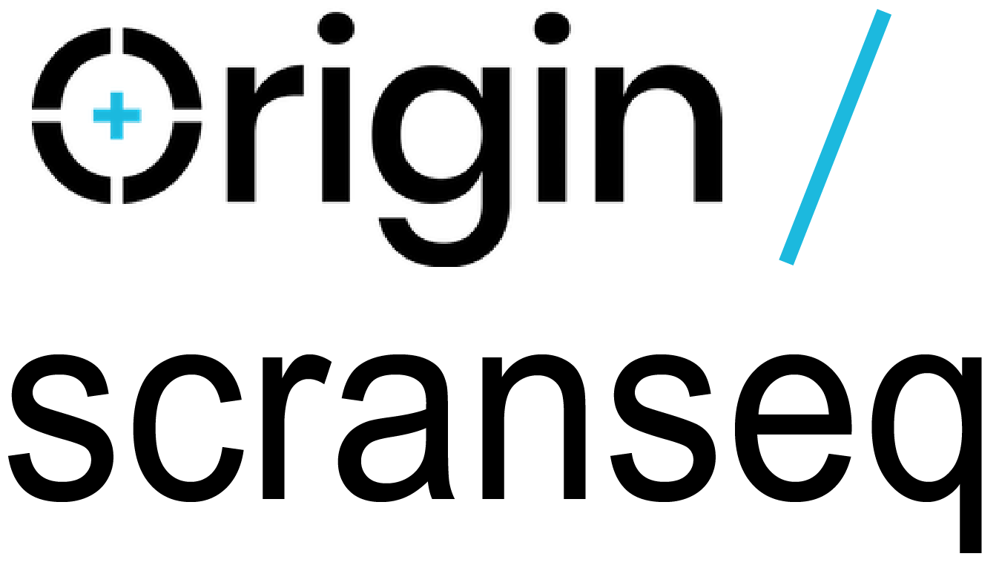
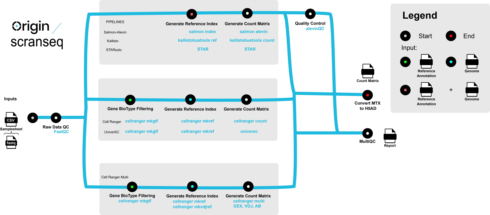

<h1>
  <picture>
    <source media="(prefers-color-scheme: dark)" srcset="docs/images/origin_scrnaseq_logo_white.png">
    
  </picture>
</h1>


[](https://www.nextflow.io/)
[](https://docs.conda.io/en/latest/)
[](https://www.docker.com/)
[](https://sylabs.io/docs/)
[](https://cloud.seqera.io/launch?pipeline=https://github.com/nf-core/scrnaseq)


## Introduction

**origin/scrnaseq** is a bioinformatics pipeline for processing 10x Genomics single-cell RNA-seq data including 10x Genomics immune profiling data.

Available pipelines:

- SimpleAF(Alevin-Fry) + AlevinQC
- STARSolo
- Kallisto + BUStools
- Cellranger
- UniverSC
- Cellrangerarc for gene expression and scATACseq
- Cellranger multi for 5' gex, vdj and citeseq




## Usage

> [!NOTE]
> If you are new to Nextflow, please refer to [this page](https://nf-co.re/docs/usage/installation) on how to set-up Nextflow. Make sure to [test your setup](https://nf-co.re/docs/usage/introduction#how-to-run-a-pipeline) with `-profile test` before running the workflow on actual data.

> To test the immune profiling pipeline, use `-profile test_cellrangermulti`

For [scRNAseq](https://genomemedicine.biomedcentral.com/articles/10.1186/s13073-017-0467-4), first prepare a samplesheet with your input data that looks as follows:

`samplesheet.csv`:

```csv
sample,fastq_1,fastq_2,expected_cells
pbmc8k,pbmc8k_S1_L007_R1_001.fastq.gz,pbmc8k_S1_L007_R2_001.fastq.gz,10000
pbmc8k,pbmc8k_S1_L008_R1_001.fastq.gz,pbmc8k_S1_L008_R2_001.fastq.gz,10000
```

Each row represents a fastq file (single-end) or a pair of fastq files (paired end).

Cellrangermulit pipeline requires an additional column _feature_type_ to indicate which of the feature barcode technology the data belongs to

|_feature_type_ | description      |
----------------|-------------     |
| `gex`         | gene expression  |
| `vdjb`        | BCR profiling    |
| `vdjt`        | TCR profiling    |
| `ab`          | antibody profiling (feature barcoding) |
| `crispr`      | CRISPR capture   |


Now, you can run the pipeline using:

```bash
nextflow run nf-core/scrnaseq \
   -profile <docker/singularity/.../institute> \
   --input samplesheet.csv \
   --fasta GRCm38.p6.genome.chr19.fa \
   --gtf gencode.vM19.annotation.chr19.gtf \
   --protocol 10XV2 \
   --aligner <alevin/kallisto/star/cellranger/universc/cellrangermulti> \
   --outdir <OUTDIR>
```

> [!WARNING]
> Please provide pipeline parameters via the CLI or Nextflow `-params-file` option. Custom config files including those provided by the `-c` Nextflow option can be used to provide any configuration _**except for parameters**_; see [docs](https://nf-co.re/docs/usage/getting_started/configuration#custom-configuration-files).

For more details and further functionality, please refer to the [usage documentation](https://nf-co.re/scrnaseq/usage) and the [parameter documentation](https://nf-co.re/scrnaseq/parameters).


## Credits

origin/scrnaseq was originally written by [nf-core](https://nf-co.re) and [Edward Olaniru](https://github.com/eolaniru).

This pipeline uses code and infrastructure developed and maintained by the [nf-core](https://nf-co.re) community, reused here under the [MIT license](https://github.com/nf-core/tools/blob/master/LICENSE).

> The nf-core framework for community-curated bioinformatics pipelines.
>
> Philip Ewels, Alexander Peltzer, Sven Fillinger, Harshil Patel, Johannes Alneberg, Andreas Wilm, Maxime Ulysse Garcia, Paolo Di Tommaso & Sven Nahnsen.
>
> Nat Biotechnol. 2020 Feb 13. doi: 10.1038/s41587-020-0439-x.
> In addition, references of tools and data used in this pipeline are as follows:
## Citations

If you use origin/scrnaseq for your analysis, please cite it using the following doi: [10.5281/zenodo.3568187](https://doi.org/10.5281/zenodo.3568187)

The basic benchmarks that were used as motivation for incorporating the four available modular workflows (Cellranger, Kalisto/BUStools, alevin and STARsolo) for scRNAseq can be found in [this publication](https://www.biorxiv.org/content/10.1101/673285v2).


